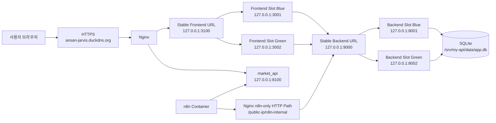
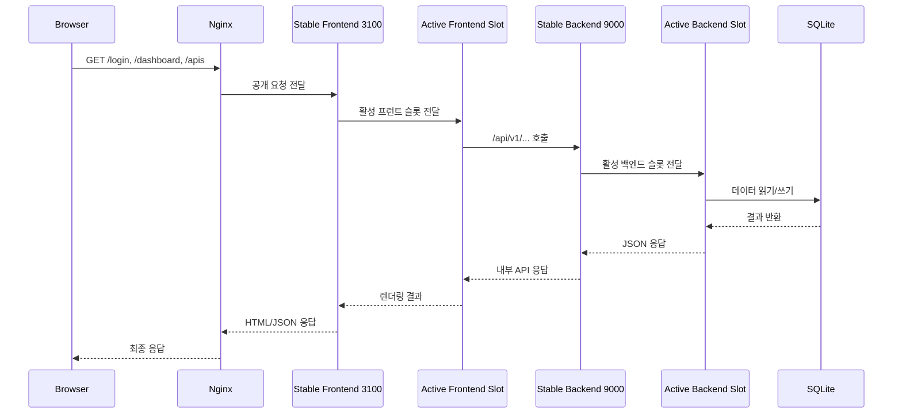
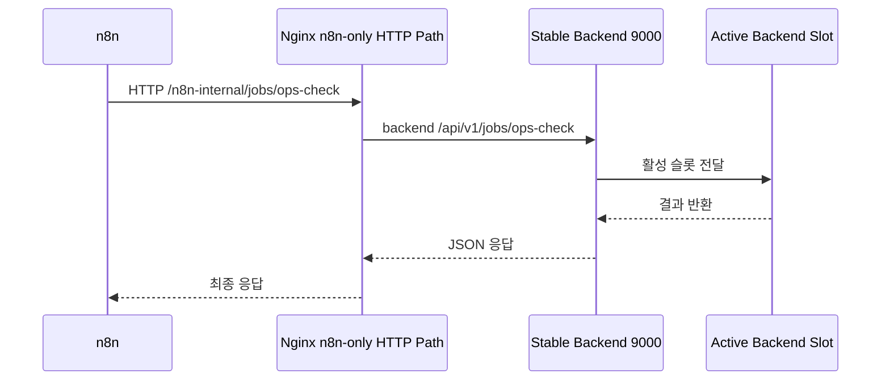

# 시스템 개요

이 문서는 `my-api` 프로젝트를 처음 보는 사람이 "이 시스템이 무엇이고, 어디서 돌아가고, 어떻게 배포되고, 무엇으로 확인하는지"를 한 번에 이해하도록 만든 운영 개요 문서다.

## 1. 한 줄 요약

- `frontend`: Next.js 관리자 콘솔
- `backend`: FastAPI 관리자 API
- `market_api`: 시장 신호/브리핑 전용 별도 FastAPI
- `n8n`: 외부 알림/자동화 워크플로
- `nginx`: 외부 HTTPS 진입점 + 내부 안정 프런트/백엔드 주소
- `systemd`: 앱 프로세스 관리
- `SQLite`: 운영 데이터 저장소

## 2. 전체 구성



핵심은 백엔드와 프런트엔드가 모두 단일 런타임 포트를 직접 노출하지 않는다는 점이다.  
모든 내부 호출은 안정 주소로 모이고, 그 주소가 현재 활성 슬롯인 `blue` 또는 `green` 으로 연결된다.

## 3. 요청 흐름

### 3-1. 관리자 화면 요청



### 3-2. n8n 운영 호출



## 4. 배포 구조

### 4-1. 디렉터리 역할

- `/srv/my-api/repo`
  - 서버가 `git fetch` 하는 읽기 전용 저장소 미러
- `/srv/my-api/releases/<release_id>`
  - 각 배포 단위의 실제 릴리즈 디렉터리
- `/srv/my-api/current`
  - 현재 활성 릴리즈 심볼릭 링크
- `/srv/my-api/slots/backend-blue`
  - `blue` 백엔드 슬롯이 실행 중인 릴리즈를 가리키는 심볼릭 링크
- `/srv/my-api/slots/backend-green`
  - `green` 백엔드 슬롯이 실행 중인 릴리즈를 가리키는 심볼릭 링크
- `/srv/my-api/slots/frontend-blue`
  - `blue` 프런트 슬롯이 실행 중인 릴리즈를 가리키는 심볼릭 링크
- `/srv/my-api/slots/frontend-green`
  - `green` 프런트 슬롯이 실행 중인 릴리즈를 가리키는 심볼릭 링크
- `/srv/my-api/state/backend-active-slot`
  - 현재 활성 백엔드 슬롯 이름
- `/srv/my-api/state/frontend-active-slot`
  - 현재 활성 프런트 슬롯 이름

### 4-2. 배포 흐름

```mermaid
flowchart TD
    Start[deploy_from_server.sh] --> Fetch[서버 repo fetch]
    Fetch --> Release[새 release 생성]
    Release --> Meta[.release-meta.json 기록]
    Meta --> SyncN8N[n8n compose 동기화]
    SyncN8N --> BackPick[유휴 backend 슬롯 선택]
    BackPick --> BackBoot[유휴 backend 슬롯 기동]
    BackBoot --> BackVerify[슬롯 healthz/version 검증]
    BackVerify --> BackSwitch[Nginx backend upstream 전환]
    BackSwitch --> BackStable[9000/version 재검증]
    BackStable --> Full{mode == full}
    Full -- no --> Finish[배포 완료]
    Full -- yes --> FrontPick[유휴 frontend 슬롯 선택]
    FrontPick --> FrontBoot[유휴 frontend 슬롯 기동]
    FrontBoot --> FrontVerify[/login, /api/runtime/version 검증]
    FrontVerify --> FrontSwitch[Nginx frontend upstream 전환]
    FrontSwitch --> FrontStable[3100/login 재검증]
    FrontStable --> Others[market_api, n8n 검증]
    Others --> Finish
```

배포 실패 시 핵심 복구는 "이전 슬롯으로 upstream 되돌리기"다.  
즉 서비스 전체를 다시 내리는 것이 아니라, 트래픽 방향만 직전 정상 슬롯으로 되돌린다.

## 5. 현재 운영에서 중요한 주소

### 외부 확인

- `https://ansan-jarvis.duckdns.org/login`
- `https://ansan-jarvis.duckdns.org/healthz`
- `https://ansan-jarvis.duckdns.org/version`
- `https://ansan-jarvis.duckdns.org/api/runtime/version`

### 내부 안정 주소

- `http://127.0.0.1:3100/login`
- `http://127.0.0.1:3100/api/runtime/version`
- `http://127.0.0.1:9000/healthz`
- `http://127.0.0.1:9000/version`
- `http://127.0.0.1:8100/healthz`

### 슬롯 직접 확인

- `http://127.0.0.1:3001/login`
- `http://127.0.0.1:3001/api/runtime/version`
- `http://127.0.0.1:3002/login`
- `http://127.0.0.1:3002/api/runtime/version`
- `http://127.0.0.1:8001/version`
- `http://127.0.0.1:8002/version`

## 6. 현재 운영 확인 명령

### 상태 한 번에 보기

```bash
./scripts/check_release_drift.sh oci-ubuntu
```

정상이라면 아래가 서로 맞아야 한다.

- `local_head`
- `origin_main`
- `server_git_sha`
- `backend_active_slot`
- `backend_release_slot`
- `backend_version_slot`
- `backend_upstream_target`
- `frontend_active_slot`
- `frontend_release_slot`
- `frontend_version_slot`
- `frontend_upstream_target`

### 서버에서 직접 보기

```bash
ssh oci-ubuntu 'readlink -f /srv/my-api/current'
ssh oci-ubuntu 'cat /srv/my-api/state/backend-active-slot'
ssh oci-ubuntu 'cat /srv/my-api/state/frontend-active-slot'
ssh oci-ubuntu 'curl -fsS http://127.0.0.1:9000/version'
ssh oci-ubuntu 'curl -fsS http://127.0.0.1:3100/api/runtime/version'
ssh oci-ubuntu 'curl -fsS https://ansan-jarvis.duckdns.org/version'
ssh oci-ubuntu 'curl -fsS https://ansan-jarvis.duckdns.org/api/runtime/version'
ssh oci-ubuntu 'sudo systemctl status personal-api-admin-backend@blue --no-pager -l'
ssh oci-ubuntu 'sudo systemctl status personal-api-admin-backend@green --no-pager -l'
ssh oci-ubuntu 'sudo systemctl status personal-api-admin-frontend@blue --no-pager -l'
ssh oci-ubuntu 'sudo systemctl status personal-api-admin-frontend@green --no-pager -l'
```

### 슬롯 전환이 실제 되는지 보기

```bash
./scripts/deploy_from_server.sh oci-ubuntu origin/main full
./scripts/check_release_drift.sh oci-ubuntu
```

이 명령을 실행하면 활성 백엔드 슬롯과 프런트 슬롯이 각각 `blue -> green` 또는 `green -> blue` 로 바뀌어야 한다.

## 7. 어떤 파일이 무엇을 담당하는가

### 앱

- `backend/app/main.py`
  - `/healthz`, `/version` 제공
- `frontend/app/api/runtime/version/route.ts`
  - 프런트 런타임 버전 정보 제공
- `frontend/lib/server-api.ts`
  - 프런트가 내부적으로 백엔드를 호출하는 공통 경로
- `services/market_api/`
  - 시장 신호/브리핑 전용 별도 서비스

### 배포

- `scripts/deploy_from_server.sh`
  - 로컬에서 SSH로 서버 배포 트리거
- `scripts/server_prepare_release.sh`
  - 서버에서 `fetch -> release 생성 -> n8n sync -> activate`
- `scripts/remote_activate_release.sh`
  - backend/frontend 슬롯 기동, 검증, upstream 전환, 후속 서비스 검증

### 운영 판별

- `scripts/check_server_drift.sh`
  - 서버 내부 기준 드리프트 점검
- `scripts/check_release_drift.sh`
  - 로컬/원격/실행 중 상태 비교
- `deploy/systemd/personal-api-admin-backend@.service`
  - backend dual-slot systemd 템플릿
- `deploy/systemd/personal-api-admin-frontend@.service`
  - frontend dual-slot systemd 템플릿
- `deploy/nginx/site.conf.example`
  - 외부 HTTPS + 내부 `3100`, `9000` 안정 주소

## 8. 지금 남아 있는 한계

- `market_api`는 아직 단일 인스턴스다.
- SQLite를 공유하므로 파괴적 스키마 변경은 여전히 별도 주의가 필요하다.
- `full` 배포는 프런트/백엔드 무중단에 가까워졌지만, `market_api` 재시작은 여전히 남는다.

즉 현재 구조는 "프런트와 백엔드 모두 dual-slot 기준으로 전환"까지는 정리됐고, 다음 확장 대상은 `market_api` 전략과 DB 마이그레이션 안전성이다.
